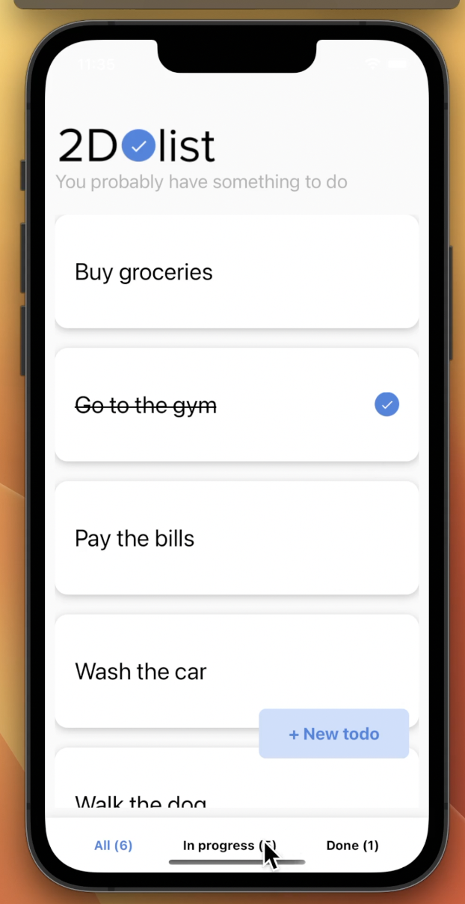

# 2DoList

2DoList is a simple and intuitive to-do app built with React Native. It helps you organize your tasks effectively with a clean and user-friendly interface.

.
- Simple and elegant design for better usability.

## Installation

1. Clone the repository:
   ```bash
   git clone https://github.com/Ayan-Alam25/react-native-todolist.git
   ```
2. Navigate to the project directory:
   ```bash
   cd react-native-todolist
   ```
3. Install dependencies:
   ```bash
   npm install
   ```
4. Run the app:
   ```bash
   npm start
   ```

## Technology Stack
- **React Native**: Framework for building native apps using React.
- **JavaScript**: Programming language used for app logic and functionality.

## Contributing
Contributions are welcome! Feel free to fork this repository, make your changes, and submit a pull request.

## License
This project is licensed under the MIT License. See the LICENSE file for more details.
